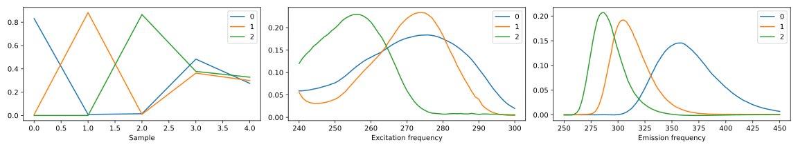

==================================================
TLViz — Visualising and analysing component models
==================================================

.. image:: https://github.com/tensorly/viz/workflows/tests/badge.svg
    :target: https://github.com/tensorly/viz/actions/workflows/tests.yml
    :alt: Tests

.. image:: https://codecov.io/gh/tensorly/viz/branch/main/graph/badge.svg?token=QhgCjtr2qk
    :target: https://codecov.io/gh/tensorly/viz
    :alt: Coverage

.. image:: https://github.com/tensorly/viz/actions/workflows/build_doc.yml/badge.svg
        :target: https://github.com/tensorly/viz/actions/workflows/build_doc.yml
        :alt: Documentation Status

.. image:: https://img.shields.io/badge/code%20style-black-000000.svg
    :target: https://github.com/psf/black

TLViz is a Python package for visualising component-based decomposition models like PARAFAC and PCA.

Documentation
-------------

The documentation
is available on `the TensorLy website <https://tensorly.org/viz>`_ and includes

* A `primer on tensors <http://tensorly.org/viz/stable/about_tensors.html#>`_, `tensor factorisations <http://tensorly.org/viz/stable/about_tensors.html#what-are-tensor-factorisations>`_ and the `notation we use <http://tensorly.org/viz/stable/about_tensors.html#notation>`_
* `An example gallery <http://tensorly.org/viz/stable/auto_examples/index.html>`_
* `The API reference <http://tensorly.org/viz/stable/api.html>`_

Dependencies
------------

TLViz supports Python 3.7 or above (it may also work with Python 3.6, though that is not officially supported).

Installation requires matplotlib, numpy, pandas, scipy, statsmodels and xarray.

Installation
------------

To install the latest stable release of TLViz and its dependencies, run:

.. code:: raw

    pip install tensorly-viz

There is also functionality to create improved QQ-plots with Pingoiun.
However, this is disabled by default due to the restrictive GPL lisence.
To enable this possibility, you must manually `install Pingoiun <https://pingouin-stats.org>`_.

To install the latest development version of TLViz, you can either clone
this repo or run

.. code:: raw

    pip install git+https://github.com/marieroald/tlviz.git

Some extra dependencies are needed to run the examples, tests or build the documentation.
For more information about installing these dependencies, see the `installation guide <https://tensorly.org/viz/stable/installation.html>`_.

Example
-------

.. code:: python

    import tlviz
    import matplotlib.pyplot as plt
    from tensorly.decomposition import parafac

    def fit_parafac(dataset, num_components, num_inits):
        model_candidates = [
            parafac(dataset.data, num_components, init="random", random_state=i)
            for i in range(num_inits)
        ]
        model = tlviz.multimodel_evaluation.get_model_with_lowest_error(
            model_candidates, dataset
        )
        return tlviz.postprocessing.postprocess(model, dataset)

    data = tlviz.data.load_aminoacids()
    cp_tensor = fit_parafac(data, 3, num_inits=3)
    tlviz.visualisation.components_plot(cp_tensor)
    plt.show()

.. code:: raw

    Loading Aminoacids dataset from:
    Bro, R, PARAFAC: Tutorial and applications, Chemometrics and Intelligent Laboratory Systems, 1997, 38, 149-171

This example uses TensorLy to fit five three-component PARAFAC models to the data. Then it uses TLViz to:

#. Select the model that gave the lowest reconstruction error,
#. normalise the component vectors, storing their magnitude in a separate weight-vector,
#. permute the components in descending weight (i.e. signal strength) order,
#. flip the components so they point in a logical direction compared to the data,
#. convert the factor matrices into Pandas DataFrames with logical indices,
#. and plot the components using matplotlib.

All these steps are described in the `API documentation <https://tensorly.org/viz/stable/api.html>`_ with references to the literature.

Testing
-------

The test suite requires an additional set of dependencies. To install these, run

.. code:: raw

    pip install tlviz[test]

or

.. code:: raw

    pip install -e .[test]

inside your local copy of the TLViz repository.

The tests can be run by calling ``pytest`` with no additional arguments.
All doctests are ran by default and a coverage summary will be printed on the screen.
To generate a coverage report, run ``coverage html``.

Contributing
------------

Contributions are welcome to TLViz, see the `contribution guidelines <http://tensorly.org/viz/stable/contributing.html>`_.
