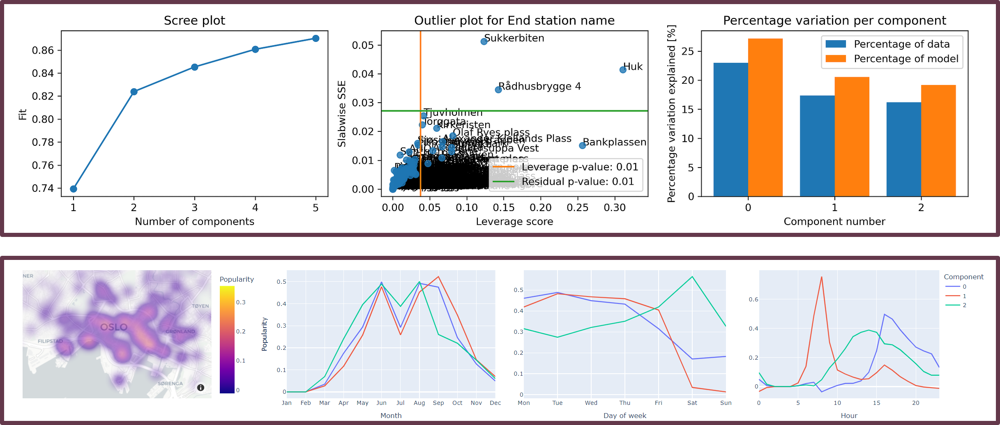
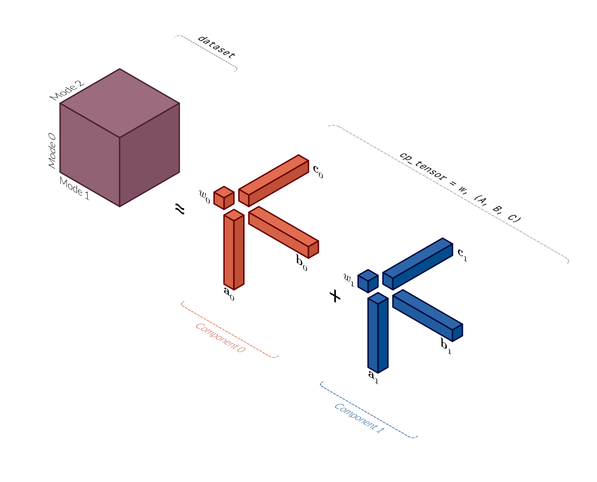

ComponentVis — Visualising and analysing component models
=========================================================

ComponentVis is a Python package that helps you inspect your component models with insightful analysis and beautiful visualisations!
It is designed around the TensorLy API for PARAFAC/CP decompositions to fit seamlessly into your data analysis workflow.
With ComponentVis, you can combine metadata xarray DataArrays and Pandas DataFrames with your extracted factor matrices, turning them into rich DataFrames with meaningful indices.
To get started, take a look at the :ref:`examples` or the :ref:`API`.

   Illustration of a PARAFAC/CP model and how such models are represented by TensorLy and ComponentVis. See :ref:`about-tensors` for more information.

.. toctree::
   :maxdepth: 2
   :caption: Contents:

   about_tensors
   installation
   auto_examples/index
   api
   tensorly_backends
   contributing
   references

Indices and tables
==================
* :ref:`genindex`
* :ref:`modindex`
* :ref:`search`
